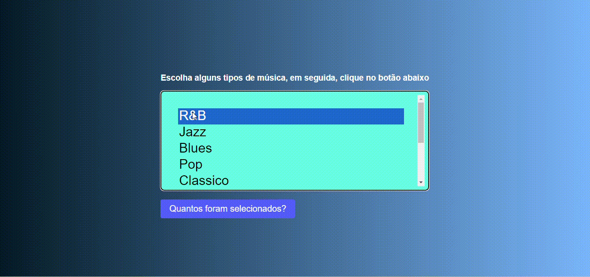

# laco-for 

* [introdoção](#introducao)
* [funcionalidades](#funcionalidades)
* [Tecnologias utilizadas](#tecnologias-utilizadas)
* [Autores](#autores)

## Introdução
Este arquivo HTML demonstra o uso de um formulário com um menu suspenso de múltipla seleção e um botão. Os usuários podem escolher seus gêneros musicais preferidos no menu suspenso e clicar no botão para exibir o número total de gêneros selecionados usando JavaScript.

Utilizando o laço for onde o mesmo cria um loop que consiste em três expressões opcionais, dentro de parênteses e separadas por ponto e vírgula, seguidas por uma declaração ou uma sequência de declarações executadas em sequência.

## Funcionalidades

No contador existe uma lista de música, onde temos vário estilos de músicas. O usuário que acessar o site pode escolher quantos tipos de gêneros musicais quiser e apertar o botão.

Após apertar o botão abaixo da lista, aparecerá uma mensagem na tela mostrando quantos tipos de musicas o usuário escolheu.

## Tecnologias Utilizadas
* [<code></code>](https://developer.mozilla.org/pt-BR/docs/Web/HTML)
* [<code></code>](https://git-scm.com/)
* [<code></code>](https://code.visualstudio.com/)
* [<code></code>](https://github.com/)
* [<code></code>](https://developer.mozilla.org/pt-BR/docs/Web/JavaScript)
* [<code></code>](https://developer.mozilla.org/pt-BR/docs/Web/CSS)
## Autores
* ``Aluno 2ºC:``Rafael Souza Mastellini